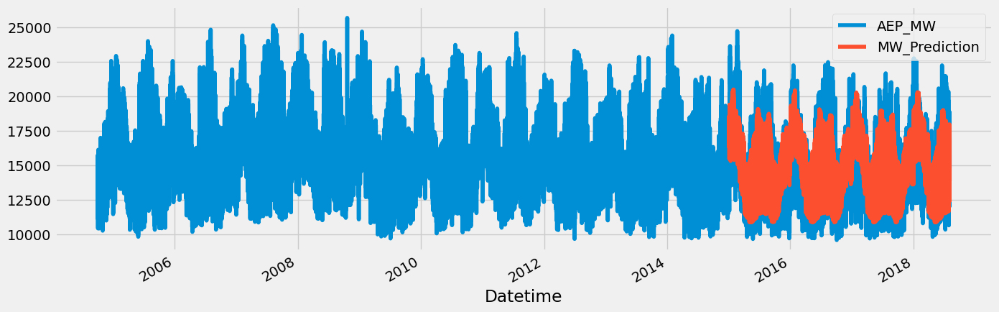
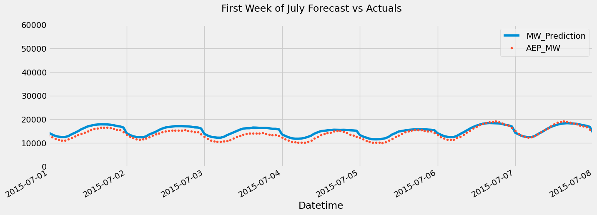
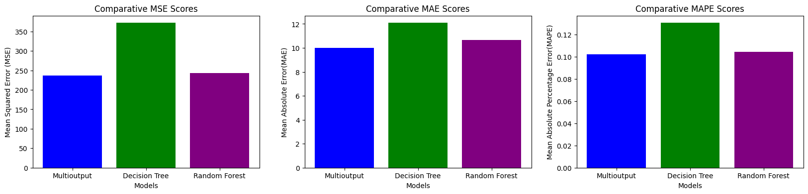

```
  /$$$$$$  /$$   /$$ /$$$$$$$   /$$$$$$ 
 /$$__  $$| $$  | $$| $$__  $$ /$$__  $$
| $$  \__/| $$  | $$| $$  \ $$| $$  \ $$
|  $$$$$$ | $$  | $$| $$  | $$| $$  | $$
 \____  $$| $$  | $$| $$  | $$| $$  | $$
 /$$  \ $$| $$  | $$| $$  | $$| $$  | $$
|  $$$$$$/|  $$$$$$/| $$$$$$$/|  $$$$$$/
 \______/  \______/ |_______/  \______/ 
```

# data-exploration

This repository is meant to document, explain and store all research linked to the automation of ML pipelines and LLM experiments for various tasks and type of data.

The notebooks in `src/TPOT/*` are meant to propose a hand-on workshop with [TPOT](https://epistasislab.github.io/tpot/)(which is a Python Automated Machine Learning tool that optimizes machine learning pipelines using genetic programming) and other tools. Each notebook also has a noticeable use for the missions of SudoGroup when it comes to proposing optimizations in cloud usage (notably rightsizing, cost and consumption forecasting). 


The notebook in `src/LLM-experiments/*` are meant to explore and comprehend functionnalities such as function calling and retrieval-augmented generation. We use publicly available data (SudoGroup website blogs) as our knwledge base. It aims to show that we can achieve interesting data retrieval/analysis locally with an LLM as well as common practices for FC and RAG.

In the notebooks, parallels with the missions that SudoGroup leads are made in order for the reader to better understand the logic and motivations behind the pipelines.

In each notebook you will find explanation of the models used, their deployment and evaluation : 

**Time Series Forecasting**




**Multi-Target Regression**



> N.B. Each notebook is documented but I assumed that the reader has a minimum of knowledge in ML and basic models as well as common practices in data science / engineering. Otherwise please open an issue and I will be glad to answer it and document/modify the code accordingly.


--- 

Pierre Lague @SudoGroup :)

